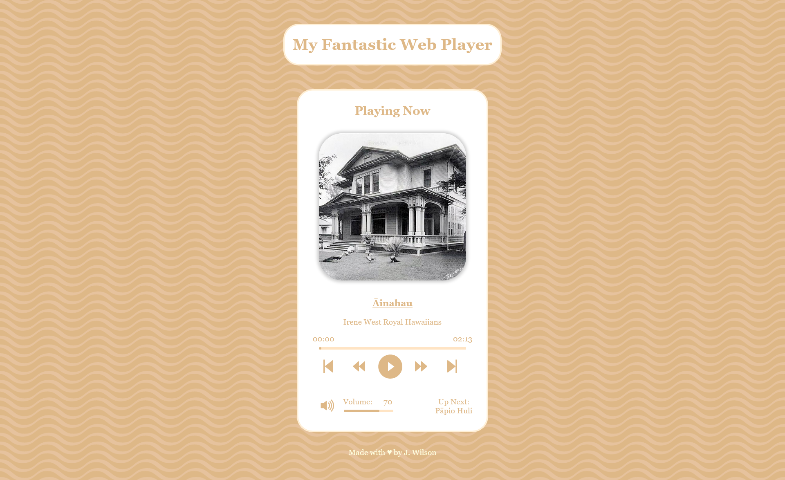

# My Fantastic Web Player

This is a react app that plays audio using the [use-sound API](https://www.npmjs.com/package/use-sound) and subsequently the [Howler.js library](https://github.com/goldfire/howler.js#documentation). It has custom CSS that should translate well between browsers.

## Table of contents

- [Overview](#overview)
  - [The challenge](#the-challenge)
  - [Screenshot](#screenshot)
  - [Links](#links)
- [My process](#my-process)
  - [Built with](#built-with)
  - [What I learned](#what-i-learned)
  - [Continued development](#continued-development)
  - [Useful resources](#useful-resources)
- [Author](#author)
- [Acknowledgements](#acknowledgements)

## Overview

### The challenge

Users should be able to:

- Play a song
- Switch between songs, maintaining volume between each song in the playlist
- Seek to different parts of the song (either through clicking on the range, or by using a skip/rewind button)
- Change the volume through either a range or mute button
- Click on the name of the song for more information about the song

### Screenshot



### Links

- [Live Site via Vercel](https://music-player-beryl.vercel.app)

## My process

### Built with

- React
- React Contexts
- use-sound
- Howler.js
- React Icons
- setInterval/clearInterval js functions

### What I learned

This was an exercise in learning how to use the useEffect hook. By far that was my greatest challenge. I ended up learning a few crucial details.

First was that use-sound takes advantage of the fact that most browsers disable auto-play to load slower. While this sounds like this wouldn't be a problem, it made a huge challenge when it came to the dependency arrays in useEffect.

Take the following code for example:

```
useEffect(() => {
    const updateTime = () => {
        if(currentSong["sound"]){
            setCurrentTime(currentSong["sound"].seek([]) * 1000);
        }
    }
        const interval = setInterval(updateTime, 1000);
        return () => clearInterval(interval);
    }, [isPlaying, currentTime]);
```

This piece of code is what allows us to track the current time on an interval of 1 second (1000 ms). The initial reaction for me was, "Well it depends on sound.seek([]) so that should be in the dependency array." HOWEVER, because use-sound takes a while to load the audio, including the Howler.js "sound" variable, it would throw an error because when the page initially loads, sound is undefined.

The way that I got around this was by adding two variables to my dependency array: isPlaying, and currentTime. Under these two conditions, there should be some degree of change (either the song has started playing/stopped playing, or has been seeked to a different time, and thus should start tracking all over again). This useEffect was particularly tricky because of the interval -- ensuring that the clearInterval(interval) was returned was crucial in there not being funky time tracking when a playing song has the time changed manually, for example.


Another issue arose when I added the playlist functionality.

```
    const nextSong = () =>{
        currentSong["sound"].stop();
        if(playlistSpot + 1 < playlist.length){
            setPlaylistSpot(playlistSpot + 1);
        } else{
            setPlaylistSpot(0);
        }
    }
```

The above function is called when the "next" button is pressed. It seems intuitive -- stop the song that's currently playing (so that the time is reset), and then go to the next song, either the next song or 0 if the current song is the last in the playlist.

However, when I first created this function, I had tried juggling the switching of songs in this. BIG mistake. The current song would not switch fast enough, and the current song would start over and play, and then the second song would play. I resolved this by using useEffect.

```
useEffect(() =>{
        if(currentSong["sound"]){
            if(isPlaying){
                currentSong["sound"].volume(volume / 100);
                setIsPlaying(true);
                currentSong["sound"].play();
            }
        }
    }, [currentSong["sound"]]);
```

This useEffect takes care of the switching between songs and does so fairly smoothly. It is called whenever the sound variable changes in currentSong, because that is what is technically being changed around in this. Again note the if(currentSong["sound"]) -- this is again because of the lag in use-audio, without it the react app would crash because it is undefined on start up.

### Continued development

One big change I would make would be breaking down the Player.js component into smaller sub-components. When I first started the project, I was just playing one song, so it wasn't that cumbersome to keep it all in one component. However, once the playlist was added, it turned into a kind of frustrating mess. However, because I had set it all up this way, I figured it was easier to just keep it as is. If I ever feel like updating this project, this will likely be the first thing that I change.

Additionally, I feel that while use-sound is useful, it may not be the best for playlists. I feel that it wasn't really flexible to work with, and as the playlist grows, the harder management becomes. Using something like [react-playlist-player](https://www.npmjs.com/package/react-playlist-player) might make the code more clear and prevent issues as the playlist grows.

Finally, I think in the future I may try to find a way to externally store audio files in a database. This would reduce the amount of local storage I have to dedicate to the audio files.

### Useful resources

- [use-sound Documentation](https://www.npmjs.com/package/use-sound)

This was mostly useful in understanding the variables that are returned from use-sound, and how I knew what to set the variable names to.

- [Howler.js Documentation](https://github.com/goldfire/howler.js#documentation)

This was invaluable in understanding how Howler.js works under the hood. The documentation was clear and to the point, and made it easy to implement the built-in functions.

- [React Icons](https://react-icons.github.io/react-icons/)

This was where I got the icons (e.g. play, pause, skip, next song, volume, etc.) from. Specifically I used Ant Design Icons for the song control icons and Bootstrap Icons for the volume icons.

- [Using the Effect Hook React Documentation](https://reactjs.org/docs/hooks-effect.html)

This was invaluable for me, since pretty much everything in this player depends on a useEffect to dynamically render the page and keep track of states. It was really useful to see this defined as clearly as possible.

## Author

- GitHub - [jwilson10](https://github.com/jwilson10)

## Acknowledgements

Thank you to Irina Cudo, for assigning this project as a warm up. It was a great setting off point for me to further my skills in React. She gave great suggestions on how to implement this.

Another thank you to Dillon Tuck for giving me suggestions on how to improve my process if I were to do this again. It was nice to see a secondary perspective on this project, since you can sometimes get stuck in the rut.